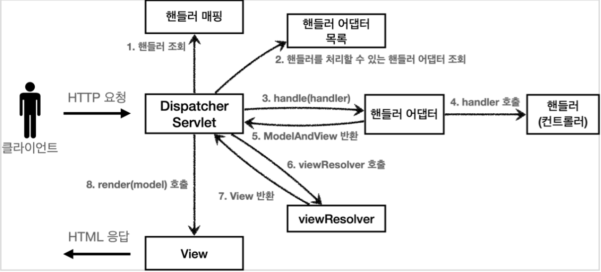
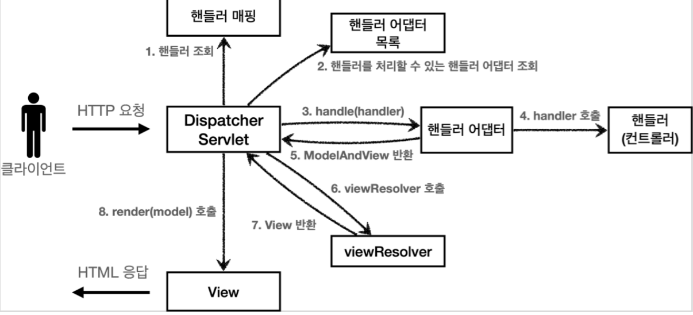

#### 스프링 MVC 전체 구조

직접 만든 MVC 프레임워크와 스프링 MVC를 비교해보자.

##### 직접 만든 MVC 프레임워크 구조


<br>

##### SpringMVC 구조


<br>

##### 직접 만든 프레임워크 스프링 MVC 비교
* FrontController -> DispatcherServlet
* handlerMappingMap -> HandlerMapping
* MyHandlerAdapter -> HandlerAdapter
* ModelView -> ModelAndView
* viewResolver -> ViewResolver
* MyView -> View 

<br>

##### DispatcherServlet 구조 살펴보기

`org.springframework.web.servlet.DispatcherServlet`

스프링 MVC도 프론트 컨트롤러 패턴으로 구현되어 있다.
스프링 MVC의 프론트 컨트롤러가 바로 디스패처 서블릿(DispatcherServlet)이다.
그리고 이 디스패처 서블릿이 바로 스프링 MVC의 핵심이다.

<br>

##### DispacherServlet 서블릿 등록
* DispacherServlet 도 부모 클래스에서 HttpServlet 을 상속 받아서 사용하고, 서블릿으로 동작한다.
  * DispatcherServlet FrameworkServlet HttpServletBean HttpServlet
* 스프링 부트는 DispacherServlet 을 서블릿으로 자동으로 등록하면서 모든 경로( urlPatterns="/" )에 대해서 매핑한다.
  * 참고: 더 자세한 경로가 우선순위가 높다. 그래서 기존에 등록한 서블릿도 함께 동작한다.

<br>

##### 요청 흐름
* 서블릿이 호출되면 HttpServlet 이 제공하는 serivce() 가 호출된다.
* 스프링 MVC는 DispatcherServlet 의 부모인 FrameworkServlet 에서 service() 를 오버라이드 해두었다.
* `FrameworkServlet.service()` 를 시작으로 여러 메서드가 호출되면서 `DispacherServlet.doDispatch()` 가 호출된다.

<br>

지금부터 `DispacherServlet` 의 핵심인 `doDispatch()` 코드를 분석해보자. 최대한 간단히 설명하기 위해 예외처리, 인터셉터 기능은 제외했다.

<br>

`DispacherServlet.doDispatch()`
```java

```

<br>

##### SpringMVC 구조


###### 동작 순서
1. __핸들러 조회__: 핸들러 매핑을 통해 요청 URL에 매핑된 핸들러(컨트롤러)를 조회한다.
2. __핸들러 어댑터 조회__: 핸들러를 실행할 수 있는 핸들러 어댑터를 조회한다.
3. __핸들러 어댑터 실행__: 핸들러 어댑터를 실행한다.
4. __핸들러 실행__: 핸들러 어댑터가 실제 핸들러를 실행한다.
5. __ModelAndView 반환__: 핸들러 어댑터는 핸들러가 반환하는 정보를 ModelAndView로 변환해서 반환한다.
6. __viewResolver 호출__: 뷰 리졸버를 찾고 실행한다.
  * JSP의 경우: InternalResourceViewResolver 가 자동 등록되고, 사용된다.
7. __View 반환__: 뷰 리졸버는 뷰의 논리 이름을 물리 이름으로 바꾸고, 렌더링 역할을 담당하는 뷰 객체를 반환한다.
  * JSP의 경우 InternalResourceView(JstlView) 를 반환하는데, 내부에 forward() 로직이 있다.
8. __뷰 렌더링__: 뷰를 통해서 뷰를 렌더링 한다.

<br>

##### 인터페이스 살펴보기
* 스프링 MVC의 큰 강점은 DispatcherServlet 코드의 변경 없이, 원하는 기능을 변경하거나 확장할 수 있다는 점이다. 지금까지 설명한 대부분을 확장 가능할 수 있게 인터페이스로 제공한다.
* 이 인터페이스들만 구현해서 DispatcherServlet 에 등록하면 여러분만의 컨트롤러를 만들 수도 있다.

<br>

##### 주요 인터페이스 목록
* 핸들러 매핑: `org.springframework.web.servlet.HandlerMapping`
* 핸들러 어댑터: `org.springframework.web.servlet.HandlerAdapter`
* 뷰 리졸버: `org.springframework.web.servlet.ViewResolver`
* 뷰: `org.springframework.web.servlet.View`

<br>

##### 정리
스프링 MVC는 코드 분량도 매우 많고, 복잡해서 내부 구조를 다 파악하는 것은 쉽지 않다. 사실 해당 기능을 직접 확장하거나 나만의 컨트롤러를 만드는 일은 없으므로 걱정하지 않아도 된다. 왜냐하면 스프링 MVC는 전세계 수 많은 개발자들의 요구사항에 맞추어 기능을 계속 확장왔고, 그래서 여러분이 웹 애플리케이션을 만들 때 필요로 하는 대부분의 기능이 이미 다 구현되어 있다.
그래도 이렇게 핵심 동작방식을 알아두어야 향후 문제가 발생했을 때 어떤 부분에서 문제가 발생했는지 쉽게 파악하고, 문제를 해결할 수 있다. 그리고 확장 포인트가 필요할 때, 어떤 부분을 확장해야 할지 감을 잡을 수 있다. 실제 다른 컴포넌트를 제공하거나 기능을 확장하는 부분들은 강의를 진행하면서 조금씩 설명하겠다. 지금은 전체적인 구조가 이렇게 되어 있구나 하고 이해하면 된다.

우리가 지금까지 함께 개발한 MVC 프레임워크와 유사한 구조여서 이해하기 어렵지 않았을 것이다.

<br>
<br>
<br>
<br>

#### 핸들러 매핑과 핸들러 어댑터

핸들러 매핑과 핸들러 어댑터가 어떤 것들이 어떻게 사용되는지 알아보자.
지금은 전혀 사용하지 않지만, 과거에 주로 사용했던 스프링이 제공하는 간단한 컨트롤러로 핸들러 매핑과 어댑터를 이해해보자.

<br>

__Controller 인터페이스__
##### 과거 버전 스프링 컨트롤러
`org.springframework.web.servlet.mvc.Controller`
```java

```

스프링도 처음에는 이런 딱딱한 형식의 컨트롤러를 제공했다.

> 참고
> Controller 인터페이스는 @Controller 애노테이션과는 전혀 다르다.

<br>

간단하게 구현해보자.

__OldController__
```java

```

* @Component : 이 컨트롤러는 /springmvc/old-controller 라는 이름의 스프링 빈으로 등록되었다.
* 빈의 이름으로 URL을 매핑할 것이다.

<br>

__실행__
* http://localhost:8080/springmvc/old-controller
* 콘솔에 OldController.handleRequest 이 출력되면 성공이다.

__이 컨트롤러는 어떻게 호출될 수 있을까?__

##### 스프링 MVC 구조


이 컨트롤러가 호출되려면 다음 2가지가 필요하다.

<br>

* HandlerMapping(핸들러 매핑)
  * 핸들러 매핑에서 이 컨트롤러를 찾을 수 있어야 한다.
v예) 스프링 빈의 이름으로 핸들러를 찾을 수 있는 핸들러 매핑이 필요하다.
* HandlerAdapter(핸들러 어댑터)
  * 핸들러 매핑을 통해서 찾은 핸들러를 실행할 수 있는 핸들러 어댑터가 필요하다.
  * 예) Controller 인터페이스를 실행할 수 있는 핸들러 어댑터를 찾고 실행해야 한다.


스프링은 이미 필요한 핸들러 매핑과 핸들러 어댑터를 대부분 구현해두었다. 개발자가 직접 핸들러 매핑과 핸들러 어댑터를 만드는 일은 거의 없다.

<br>
<br>

__스프링 부트가 자동 등록하는 핸들러 매핑과 핸들러 어댑터__
(실제로는 더 많지만, 중요한 부분 위주로 설명하기 위해 일부 생략)

<br>

__HandlerMapping__
```java

```

<br>

__HandlerAdapter__
```java

```

핸들러 매핑도, 핸들러 어댑터도 모두 순서대로 찾고 만약 없으면 다음 순서로 넘어간다.

<br>

__1. 핸들러 매핑으로 핸들러 조회__
  * 1. `HandlerMapping` 을 순서대로 실행해서, 핸들러를 찾는다.
  * 2. 이 경우 빈 이름으로 핸들러를 찾아야 하기 때문에 이름 그대로 빈 이름으로 핸들러를 찾아주는 `BeanNameUrlHandlerMapping` 가 실행에 성공하고 핸들러인 `OldController` 를 반환한다.

__2. 핸들러 어댑터 조회__
  * 1. `HandlerAdapter` 의 `supports()` 를 순서대로 호출한다.
  * 2. `SimpleControllerHandlerAdapter` 가 `Controller` 인터페이스를 지원하므로 대상이 된다.

__3. 핸들러 어댑터 실행;__
  * 1. 디스패처 서블릿이 조회한 `SimpleControllerHandlerAdapter` 를 실행하면서 핸들러 정보도 함께 넘겨준다.
  * 2. `SimpleControllerHandlerAdapter` 는 핸들러인 `OldController` 를 내부에서 실행하고, 그 결과를 반환한다.

<br>

__정리 - OldController 핸들러매핑, 어댑터__
`OldController` 를 실행하면서 사용된 객체는 다음과 같다.
`HandlerMapping = BeanNameUrlHandlerMapping`
`HandlerAdapter = SimpleControllerHandlerAdapter`

<br>
<br>
<br>
<br>

