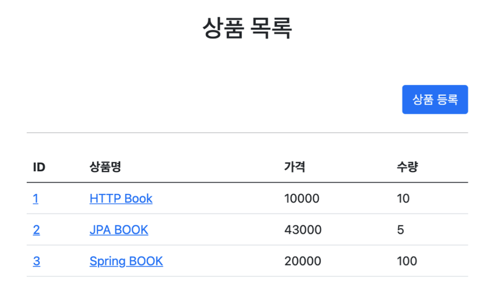
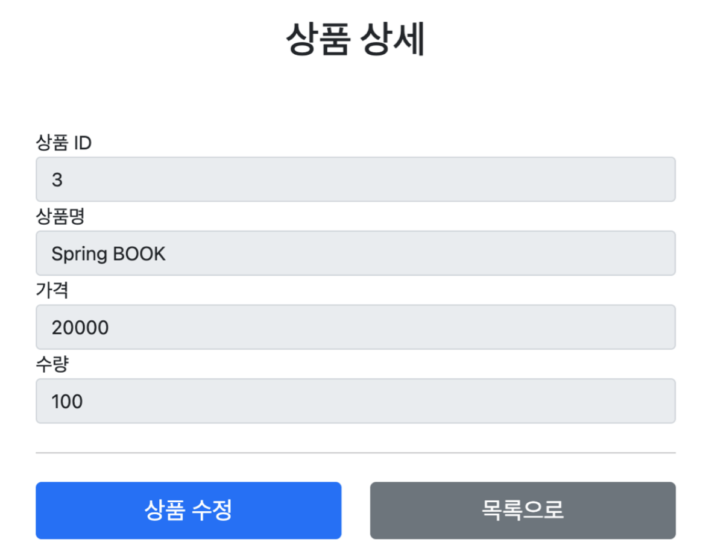
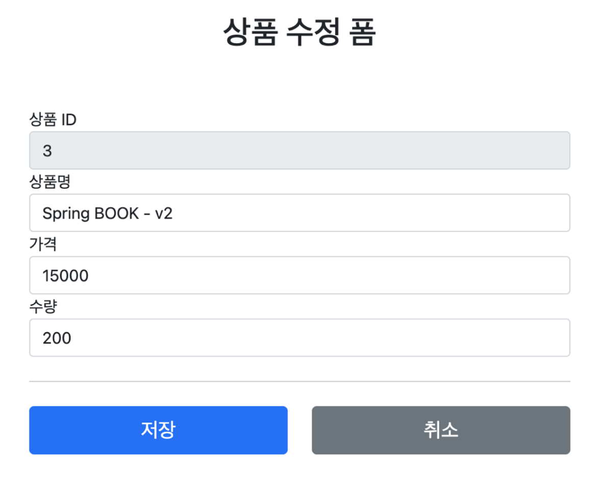
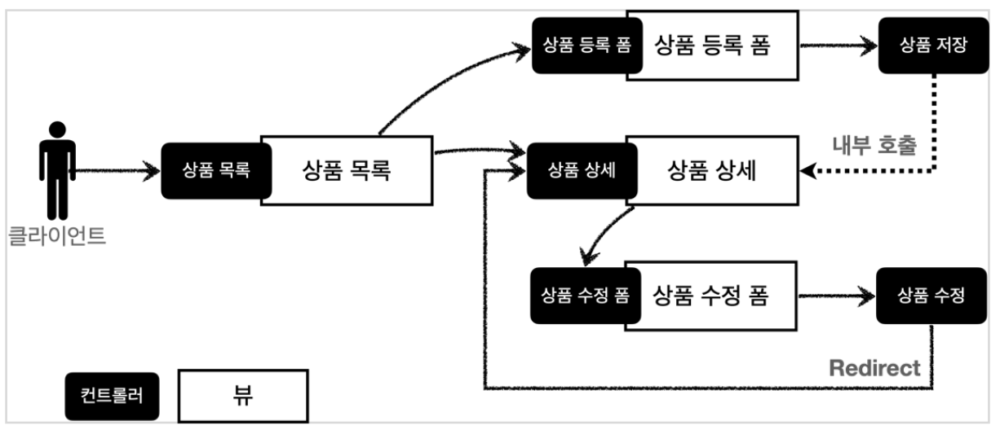
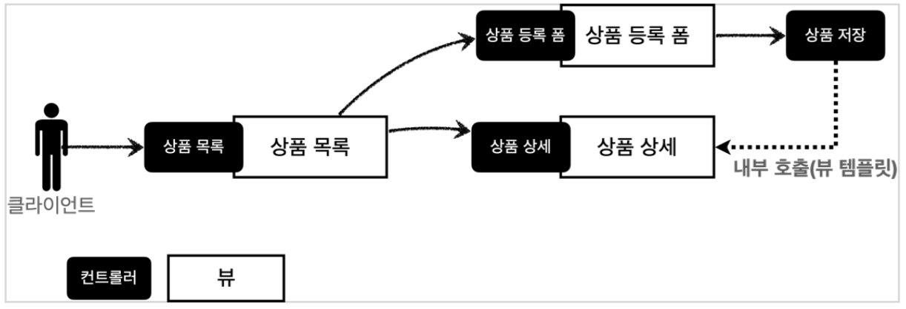
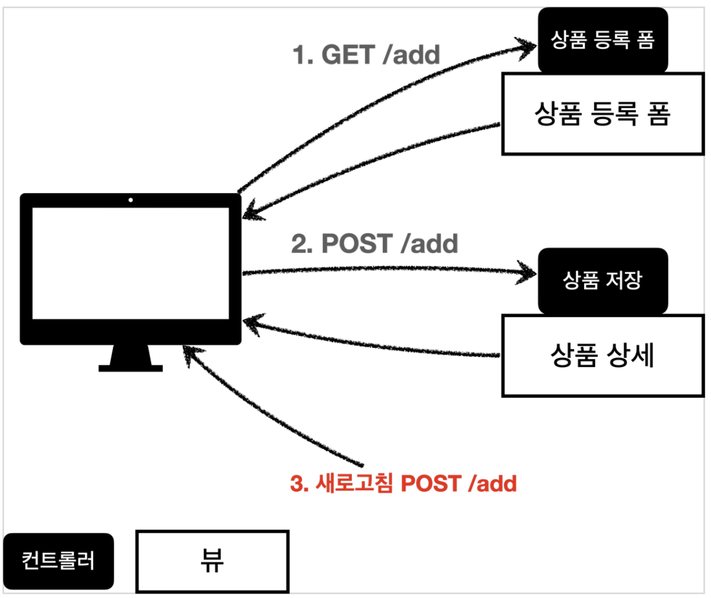
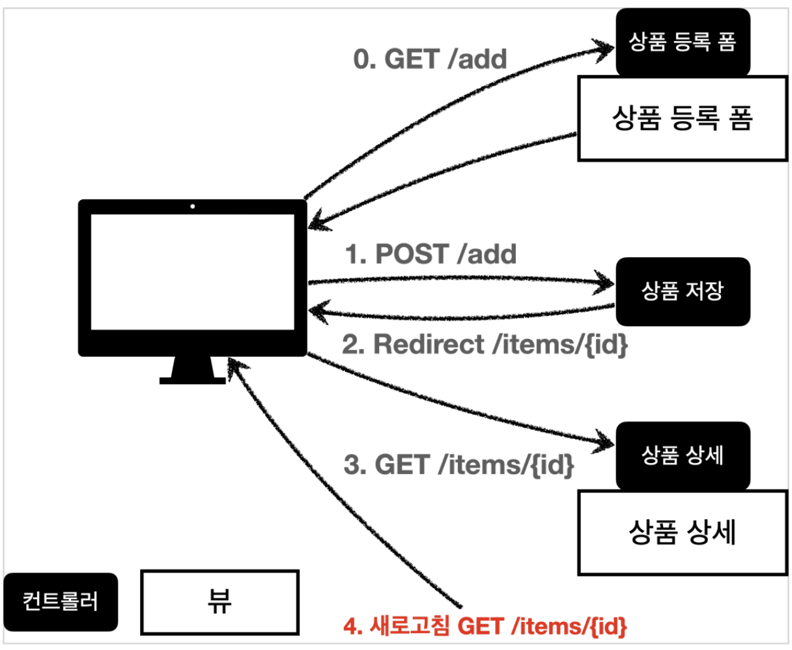

### 프로젝트 생성

#### 스프링 부트 스타터 사이트로 이동해서 스프링 프로젝트 생성
https://start.spring.io

* 프로젝트 선택
  * Project: Gradle Project
  * Language: Java
  * Spring Boot: 2.4.x
* Project Metadata
  * Group: hello
  * Artifact: item-service
  * Name: item-service
  * Package name: hello.itemservice
  * Packaging: Jar (주의!)
  * Java: 11

* Dependencies: Spring Web, Thymeleaf, Lombok

##### build.gradle
```java

```

* 동작 확인
  * 기본 메인 클래스 실행( SpringmvcApplication.main() )
  * http://localhost:8080 호출해서 Whitelabel Error Page가 나오면 정상 동작

#### Welcome 페이지 추가

편리하게 사용할 수 있도록 Welcome 페이지를 추가하자.

`/resources/static/index.html`
```html

```

* 동작 확인
  * 기본 메인 클래스 실행( `SpringmvcApplication.main()` )
  * http://localhost:8080 호출해서 Welcome 페이지가 나오면 성공

<br>
<br>

### 요구사항 분석

상품을 관리할 수 있는 서비스를 만들어보자.

#### 상품 도메인 모델
* 상품 ID
* 상품명
* 가격
* 수량

<br>

#### 상품 관리 기능
* 상품 목록
* 상품 상세
* 상품 등록
* 상품 수정

<br>

#### 서비스 화면








<br>

#### 서비스 제공 흐름



요구사항이 정리되고 디자이너, 웹 퍼블리셔, 백엔드 개발자가 업무를 나누어 진행한다.
* __디자이너__: 요구사항에 맞도록 디자인하고, 디자인 결과물을 웹 퍼블리셔에게 넘겨준다.
* __웹 퍼블리셔__: 다자이너에서 받은 디자인을 기반으로 HTML, CSS를 만들어 개발자에게 제공한다.
* __백엔드 개발자__: 디자이너, 웹 퍼블리셔를 통해서 HTML 화면이 나오기 전까지 시스템을 설계하고, 핵심 비즈니스 모델을 개발한다. 이후 HTML이 나오면 이 HTML을 뷰 템플릿으로 변환해서 동적으로 화면을 그리고, 또 웹 화면의 흐름을 제어한다.


> 참고
> React, Vue.js 같은 웹 클라이언트 기술을 사용하고, 웹 프론트엔드 개발자가 별도로 있으면, 웹 프론트엔드 개발자가 웹 퍼블리셔 역할까지 포함해서 하는 경우도 있다.
> 웹 클라이언트 기술을 사용하면, 웹 프론트엔드 개발자가 HTML을 동적으로 만드는 역할과 웹 화면의 흐름을 담당한다. 이 경우 백엔드 개발자는 HTML 뷰 템플릿을 직접 만지는 대신에, HTTP API를 통해 웹 클라이언트가 필요로 하는 데이터와 기능을 제공하면 된다.

<br>
<br>
<br>
<br>

### 상품 도메인 개발

#### Item - 상품 객체
```java

```

<br>

#### ItemRepository - 상품 저장소
```java

```

<br>

#### ItemRepositoryTest - 상품 저장소 테스트
```java

```

<br>
<br>
<br>
<br>

### 상품 서비스 HTML
핵심 비즈니스 로직을 개발하는 동안, 웹 퍼블리셔는 HTML 마크업을 완료했다.
다음 파일들을 경로에 넣고 잘 동작하는지 확인해보자.

#### 부트스트랩
참고로 HTML을 편리하게 개발하기 위해 부트스트랩 사용했다.
먼저 필요한 부트스트랩 파일을 설치하자
* __부트스트랩 공식 사이트__: https://getbootstrap.com
* __부트스트랩을 다운로드 받고 압축을 풀자.__
  * 이동: https://getbootstrap.com/docs/5.0/getting-started/download/
  * Compiled CSS and JS 항목을 다운로드하자.
  * 압축을 출고 `bootstrap.min.css` 를 복사해서 다음 폴더에 추가하자
  * `resources/static/css/bootstrap.min.css`


> 참고
> 부트스트랩(Bootstrap)은 웹사이트를 쉽게 만들 수 있게 도와주는 HTML, CSS, JS 프레임워크이다. 하나의 CSS로 휴대폰, 태블릿, 데스크탑까지 다양한 기기에서 작동한다. 다양한 기능을 제공하여 사용자가 쉽게 웹사이트를 제작, 유지, 보수할 수 있도록 도와준다. - 출처: 위키백과

<br>

#### HTML, css 파일
* `/resources/static/css/bootstrap.min.css` -> 부트스트랩 다운로드
* `/resources/static/html/items.html` -> 아래 참조
* `/resources/static/html/item.html`
* `/resources/static/html/addForm.html`
* `/resources/static/html/editForm.html`

참고로 `/resources/static` 에 넣어두었기 때문에 스프링 부트가 정적 리소스를 제공한다.

* http://localhost:8080/html/items.html
그런데 정적 리소스여서 __해당 파일을 탐색기를 통해 직접 열어도__ 동작하는 것을 확인할 수 있다.

> 참고
> 이렇게 정적 리소스가 공개되는 /resources/static 폴더에 HTML을 넣어두면, 실제 서비스에서도 공개된다. 서비스를 운영한다면 지금처럼 공개할 필요없는 HTML을 두는 것은 주의하자.

<br>

#### 상품 목록 HTML
`resources/static/html/items.html`
```html

```

<br>

#### 상품 상세 HTML
`resources/static/html/item.html`
```html

```

<br>

#### 상품 등록 폼 HTML
`resources/static/html/addForm.html`
```html

```

#### 상품 수정 폼 HTML
`resources/static/html/editForm.html`
```html

```

<br>
<br>
<br>
<br>

### 상품 목록 - 타임리프

본격적으로 컨트롤러와 뷰 템플릿을 개발해보자.

#### BasicItemController
```java

```

컨트롤러 로직은 itemRepository에서 모든 상품을 조회한 다음에 모델에 담는다. 그리고 뷰 템플릿을 호출한다.

* `@RequiredArgsConstructor`
  * `final` 이 붙은 멤버변수만 사용해서 생성자를 자동으로 만들어준다. 

```java

```
* 이렇게 생성자가 딱 1개만 있으면 스프링이 해당 생성자에 `@Autowired` 로 의존관계를 주입해준다. 
* 따라서 __final 키워드를 빼면 안된다!__, 그러면 ItemRepository 의존관계 주입이 안된다.
* 스프링 핵심원리 - 기본편 강의 참고

##### 테스트용 데이터 추가
* 테스트용 데이터가 없으면 회원 목록 기능이 정상 동작하는지 확인하기 어렵다.
* `@PostConstruct` : 해당 빈의 의존관계가 모두 주입되고 나면 초기화 용도로 호출된다.
* 여기서는 간단히 테스트용 테이터를 넣기 위해서 사용했다.

##### items.html 정적 HTML을 뷰 템플릿(templates) 영역으로 복사하고 다음과 같이 수정하자
`/resources/static/items.html` -> 복사 -> `/resources/templates/basic/items.html`

`/resources/templates/basic/items.html`
```html

```

#### 타임리프 간단히 알아보기

##### 타임리프 사용 선언
`<html xmlns:th="http://www.thymeleaf.org">`

<br>

##### 속성 변경 - th:href
`th:href="@{/css/bootstrap.min.css}"`
* `href="value1" 을 th:href="value2"` 의 값으로 변경한다.
* 타임리프 뷰 템플릿을 거치게 되면 원래 값을 th:xxx 값으로 변경한다. 만약 값이 없다면 새로 생성한다.
* HTML을 그대로 볼 때는 href 속성이 사용되고, 뷰 템플릿을 거치면 th:href 의 값이 href 로 대체되면서 동적으로 변경할 수 있다.
* 대부분의 HTML 속성을 th:xxx 로 변경할 수 있다.

<br>

##### 타임리프 핵심
* 핵심은 th:xxx 가 붙은 부분은 서버사이드에서 렌더링 되고, 기존 것을 대체한다. th:xxx 이 없으면 기존 html의 xxx 속성이 그대로 사용된다.
* HTML을 파일로 직접 열었을 때, th:xxx 가 있어도 웹 브라우저는 th: 속성을 알지 못하므로 무시한다.
* 따라서 HTML을 파일 보기를 유지하면서 템플릿 기능도 할 수 있다.

<br>

##### URL 링크 표현식 - @{...},
`th:href="@{/css/bootstrap.min.css}"`
* `@{...}` : 타임리프는 URL 링크를 사용하는 경우 @{...} 를 사용한다. 이것을 URL 링크 표현식이라 한다. 
* URL 링크 표현식을 사용하면 서블릿 컨텍스트를 자동으로 포함한다.

<br>

__상품 등록 폼으로 이동__

##### 속성 변경 - th:onclick
* onclick="location.href='addForm.html'"
* th:onclick="|location.href='@{/basic/items/add}'|"
여기에는 다음에 설명하는 리터럴 대체 문법이 사용되었다. 자세히 알아보자.

<br>

##### 리터럴 대체 - |...|
`|...|` :이렇게 사용한다.
* 타임리프에서 문자와 표현식 등은 분리되어 있기 때문에 더해서 사용해야 한다.
  * `<span th:text="'Welcome to our application, ' + ${user.name} + '!'">`
* 다음과 같이 리터럴 대체 문법을 사용하면, 더하기 없이 편리하게 사용할 수 있다.
  * `<span th:text="|Welcome to our application, ${user.name}!|">`

* 결과를 다음과 같이 만들어야 하는데
  * `location.href='/basic/items/add'`
* 그냥 사용하면 문자와 표현식을 각각 따로 더해서 사용해야 하므로 다음과 같이 복잡해진다.
  * `th:onclick="'location.href=' + '\'' + @{/basic/items/add} + '\''"`
* 리터럴 대체 문법을 사용하면 다음과 같이 편리하게 사용할 수 있다.
  * `th:onclick="|location.href='@{/basic/items/add}'|"`

<br>

##### 반복 출력 - th:each
* `<tr th:each="item : ${items}">`
* 반복은 th:each 를 사용한다. 이렇게 하면 모델에 포함된 items 컬렉션 데이터가 item 변수에 하나씩 포함되고, 반복문 안에서 item 변수를 사용할 수 있다.
* 컬렉션의 수 만큼 `<tr>..</tr>` 이 하위 테그를 포함해서 생성된다.

<br>

##### 변수 표현식 - ${...}
`<td th:text="${item.price}">10000</td>`
* 모델에 포함된 값이나, 타임리프 변수로 선언한 값을 조회할 수 있다.
* 프로퍼티 접근법을 사용한다. ( `item.getPrice()` )

<br>

##### 내용 변경 - th:text
`<td th:text="${item.price}">10000</td>`
* 내용의 값을 `th:text` 의 값으로 변경한다.
* 여기서는 10000을 `${item.price}` 의 값으로 변경한다.

<br>

##### URL 링크 표현식2 - @{...},
`th:href="@{/basic/items/{itemId}(itemId=${item.id})}"`
* 상품 ID를 선택하는 링크를 확인해보자.
* URL 링크 표현식을 사용하면 경로를 템플릿처럼 편리하게 사용할 수 있다.
* 경로 변수( `{itemId}` ) 뿐만 아니라 쿼리 파라미터도 생성한다.
* 예) `th:href="@{/basic/items/{itemId}(itemId=${item.id}, query='test')}"`
  * 생성 링크: `http://localhost:8080/basic/items/1?query=test`

<br>

##### URL 링크 간단히
* `th:href="@{|/basic/items/${item.id}|}"`
* 상품 이름을 선택하는 링크를 확인해보자.
* 리터럴 대체 문법을 활용해서 간단히 사용할 수도 있다.

<br>

> 참고
> 타임리프는 순수 HTML을 파일을 웹 브라우저에서 열어도 내용을 확인할 수 있고, 서버를 통해 뷰 템플릿을 거치면 동적으로 변경된 결과를 확인할 수 있다. JSP를 생각해보면, JSP 파일은 웹 브라우저에서 그냥 열면 JSP 소스코드와 HTML이 뒤죽박죽 되어서 정상적인 확인이 불가능하다. 오직 서버를 통해서 JSP를 열어야 한다.
> 이렇게 __순수 HTML을 그대로 유지하면서 뷰 템플릿도 사용할 수 있는 타임리프의 특징을 네츄럴 템플릿__ (natural templates)이라 한다.

<br>
<br>
<br>

### 상품 상세

상품 상세 컨트롤러와 뷰를 개발하자.

#### BasicItemController에 추가
```java

```

`PathVariable` 로 넘어온 상품ID로 상품을 조회하고, 모델에 담아둔다. 그리고 뷰 템플릿을 호출한다.

<br>

#### 상품 상세 뷰
정적 HTML을 뷰 템플릿(templates) 영역으로 복사하고 다음과 같이 수정하자.
`/resources/static/item.html` -> 복사 -> `/resources/templates/basic/item.html`

`/resources/templates/basic/item.html`
```html

```

#### 속성 변경 - th:value
`th:value="${item.id}"`
* 모델에 있는 item 정보를 획득하고 프로퍼티 접근법으로 출력한다. ( `item.getId()` )
* `value` 속성을 `th:value` 속성으로 변경한다.

<br>

#### 상품수정 링크
* `th:onclick="|location.href='@{/basic/items/{itemId}/edit(itemId=${item.id})}'|"`

<br>

#### 목록으로 링크
* `th:onclick="|location.href='@{/basic/items}'|"`

<br>
<br>
<br>
<br>

### 상품 등록 폼

상품 등록 폼

#### BasicItemController에 추가
```java

```

상품 등록 폼은 단순히 뷰 템플릿만 호출한다.

<br>

#### 상품 등록 폼 뷰
정적 HTML을 뷰 템플릿(templates) 영역으로 복사하고 다음과 같이 수정하자.
`/resources/static/addForm.html` -> 복사 -> `/resources/templates/basic/addForm.html`

`/resources/templates/basic/addForm.html`
```html

```

#### 속성 변경 - th:action
* `th:action`
* HTML form에서 `action` 에 값이 없으면 현재 URL에 데이터를 전송한다.
* 상품 등록 폼의 URL과 실제 상품 등록을 처리하는 URL을 똑같이 맞추고 HTTP 메서드로 두 기능을 구분한다.
  * 상품 등록 폼: GET `/basic/items/add`
  * 상품 등록 처리: POST `/basic/items/add`
* 이렇게 하면 하나의 URL로 등록 폼과, 등록 처리를 깔끔하게 처리할 수 있다.

#### 취소
* 취소시 상품 목록으로 이동한다.
* `th:onclick="|location.href='@{/basic/items}'|"`

<br>
<br>
<br>
<br>

### 상품 등록 처리 - @ModelAttribute

이제 상품 등록 폼에서 전달된 데이터로 실제 상품을 등록 처리해보자.
상품 등록 폼은 다음 방식으로 서버에 데이터를 전달한다.

* #### POST - HTML Form
  * content-type: application/x-www-form-urlencoded
  * 메시지 바디에 쿼리 파리미터 형식으로 전달 itemName=itemA&price=10000&quantity=10
  * 예) 회원 가입, 상품 주문, HTML Form 사용

요청 파라미터 형식을 처리해야 하므로 `@RequestParam` 을 사용하자

__상품 등록 처리 - @RequestParam__

##### addItemV1 - BasicItemController에 추가
```java

```

* 먼저 `@RequestParam String itemName` : itemName 요청 파라미터 데이터를 해당 변수에 받는다.
* `Item` 객체를 생성하고 `itemRepository` 를 통해서 저장한다.
* 저장된 `item` 을 모델에 담아서 뷰에 전달한다.

__중요__: 여기서는 상품 상세에서 사용한 `item.html` 뷰 템플릿을 그대로 재활용한다.

실행해서 상품이 잘 저장되는지 확인하자.

#### 상품 등록 처리 - @ModelAttribute

`@RequestParam` 으로 변수를 하나하나 받아서 Item 을 생성하는 과정은 불편했다.
이번에는 `@ModelAttribute` 를 사용해서 한번에 처리해보자.

##### addItemV2 - 상품 등록 처리 - ModelAttribute
```java

```

###### @ModelAttribute - 요청 파라미터 처리
`@ModelAttribute` 는 `Item` 객체를 생성하고, 요청 파라미터의 값을 프로퍼티 접근법(setXxx)으로 입력해준다.

<br>

###### @ModelAttribute - Model 추가
`@ModelAttribute` 는 중요한 한가지 기능이 더 있는데, 바로 모델(Model)에 `@ModelAttribute` 로 지정한 객체를 자동으로 넣어준다. 지금 코드를 보면 `model.addAttribute("item", item)` 가 주석처리 되어 있어도 잘 동작하는 것을 확인할 수 있다.

모델에 데이터를 담을 때는 이름이 필요하다. 이름은 `@ModelAttribute` 에 지정한 `name(value)` 속성을 사용한다. 만약 다음과 같이 `@ModelAttribute` 의 이름을 다르게 지정하면 다른 이름으로 모델에 포함된다.

<br>

`@ModelAttribute("hello") Item item` -> 이름을 `hello` 로 지정
`model.addAttribute("hello", item);` -> 모델에 `hello` 이름으로 저장

<br>

__주의__
실행전에 이전 버전인 `addItemV1` 에 `@PostMapping("/add")` 를 꼭 주석처리 해주어야 한다. 그렇지 않으면 중복 매핑으로 오류가 발생한다.

```java

```

<br>

##### addItemV3 - 상품 등록 처리 - ModelAttribute 이름 생략
```java

```

`@ModelAttribute` 의 이름을 생략할 수 있다.

__주의__
`@ModelAttribute` 의 이름을 생략하면 모델에 저장될 때 클래스명을 사용한다. 이때 클래스의 첫글자만 소문자로 변경해서 등록한다.
* 예) @ModelAttribute 클래스명 모델에 자동 추가되는 이름
  * `Item` -> `item`
  * `HelloWorld` -> `helloWorld`

<br>

##### addItemV4 - 상품 등록 처리 - ModelAttribute 전체 생략
```java

```

`@ModelAttribute` 자체도 생략가능하다. 대상 객체는 모델에 자동 등록된다. 나머지 사항은 기존과 동일하다.

<br>
<br>
<br>
<br>

### 상품 수정

#### 상품 수정 폼 컨트롤러

__BasicItemController에 추가__
```java

```

수정에 필요한 정보를 조회하고, 수정용 폼 뷰를 호출한다.

<br>

##### 상품 수정 폼 뷰
정적 HTML을 뷰 템플릿(templates) 영역으로 복사하고 다음과 같이 수정하자.
`/resources/static/editForm.html` -> 복사 -> `/resources/templates/basic/editForm.html`

`/resources/templates/basic/editForm.html`
```html

```

상품 수정 폼은 상품 등록과 유사하고, 특별한 내용이 없다.

<br>

#### 상품 수정 개발
```java

```

상품 수정은 상품 등록과 전체 프로세스가 유사하다.
* GET `/items/{itemId}/edit` : 상품 수정 폼
* POST `/items/{itemId}/edit` : 상품 수정 처리

##### 리다이렉트
상품 수정은 마지막에 뷰 템플릿을 호출하는 대신에 상품 상세 화면으로 이동하도록 리다이렉트를 호출한다.

* 스프링은 `redirect:/...` 으로 편리하게 리다이렉트를 지원한다.
* `redirect:/basic/items/{itemId}"`
  * 컨트롤러에 매핑된 `@PathVariable` 의 값은 `redirect` 에도 사용 할 수 있다.
  * `redirect:/basic/items/{itemId}` -> `{itemId}` 는 `@PathVariable Long itemId` 의 값을 그대로 사용한다.

> 참고
> 리다이렉트에 대한 자세한 내용은 모든 개발자를 위한 HTTP 웹 기본 지식 강의를 참고하자.

> 참고
> HTML Form 전송은 PUT, PATCH를 지원하지 않는다. GET, POST만 사용할 수 있다.
> PUT, PATCH는 HTTP API 전송시에 사용
> 스프링에서 HTTP POST로 Form 요청할 때 히든 필드를 통해서 PUT, PATCH 매핑을 사용하는 방법이 있지만, HTTP 요청상 POST 요청이다.

<br>
<br>
<br>
<br>

### PRG Post/Redirect/Get
사실 지금까지 진행한 상품 등록 처리 컨트롤러는 심각한 문제가 있다. (addItemV1 ~ addItemV4)
상품 등록을 완료하고 웹 브라우저의 새로고침 버튼을 클릭해보자.
상품이 계속해서 중복 등록되는 것을 확인할 수 있다.

#### 전체 흐름


그 이유는 다름 그림을 통해서 확인할 수 있다.

##### POST 등록 후 새로 고침


웹 브라우저의 새로 고침은 마지막에 서버에 전송한 데이터를 다시 전송한다.
상품 등록 폼에서 데이터를 입력하고 저장을 선택하면 POST /add + 상품 데이터를 서버로 전송한다.
이 상태에서 새로 고침을 또 선택하면 마지막에 전송한 POST /add + 상품 데이터를 서버로 다시 전송하게 된다.
그래서 내용은 같고, ID만 다른 상품 데이터가 계속 쌓이게 된다.

이 문제를 어떻게 해결할 수 있을까? 다음 그림을 보자.

##### POST, Redirect GET


웹 브라우저의 새로 고침은 마지막에 서버에 전송한 데이터를 다시 전송한다.
새로 고침 문제를 해결하려면 상품 저장 후에 뷰 템플릿으로 이동하는 것이 아니라, 상품 상세 화면으로 리다이렉트를 호출해주면 된다.
웹 브라우저는 리다이렉트의 영향으로 상품 저장 후에 실제 상품 상세 화면으로 다시 이동한다. 따라서 마지막에 호출한 내용이 상품 상세 화면인 GET /items/{id} 가 되는 것이다.
이후 새로고침을 해도 상품 상세 화면으로 이동하게 되므로 새로 고침 문제를 해결할 수 있다.

<br>

##### BasicItemController에 추가
```java

```

상품 등록 처리 이후에 뷰 템플릿이 아니라 상품 상세 화면으로 리다이렉트 하도록 코드를 작성해보자.
이런 문제 해결 방식을 PRG Post/Redirect/Get 라 한다.

__주의__
> `"redirect:/basic/items/" + item.getId()` redirect에서 `+item.getId()` 처럼 URL에 변수를 더해서 사용하는 것은 URL 인코딩이 안되기 때문에 위험하다. 다음에 설명하는 `RedirectAttributes` 를 사용하자.

<br>
<br>

#### RedirectAttributes
상품을 저장하고 상품 상세 화면으로 리다이렉트 한 것 까지는 좋았다. 그런데 고객 입장에서 저장이 잘 된 것인지 안 된 것인지 확신이 들지 않는다. 그래서 저장이 잘 되었으면 상품 상세 화면에 "저장되었습니다"라는 메시지를 보여달라는 요구사항이 왔다. 간단하게 해결해보자.

##### BasicItemController에 추가
```java

```

리다이렉트 할 때 간단히 status=true 를 추가해보자. 그리고 뷰 템플릿에서 이 값이 있으면, 저장되었습니다. 라는 메시지를 출력해보자.

실행해보면 다음과 같은 리다이렉트 결과가 나온다.
`http://localhost:8080/basic/items/3?status=true`

##### RedirectAttributes
`RedirectAttributes` 를 사용하면 URL 인코딩도 해주고, pathVarible , 쿼리 파라미터까지 처리해준다.
* `redirect:/basic/items/{itemId}`
  * pathVariable 바인딩: `{itemId}`
  * 나머지는 쿼리 파라미터로 처리: `?status=true`

<br>

##### 뷰 템플릿 메시지 추가
`resources/templates/basic/item.html`
```html

```

* `th:if` : 해당 조건이 참이면 실행
* `${param.status}` : 타임리프에서 쿼리 파라미터를 편리하게 조회하는 기능
  * 원래는 컨트롤러에서 모델에 직접 담고 값을 꺼내야 한다. 그런데 쿼리 파라미터는 자주 사용해서 타임리프에서 직접 지원한다.

뷰 템플릿에 메시지를 추가하고 실행해보면 "저장 완료!" 라는 메시지가 나오는 것을 확인할 수 있다. 물론 상품 목록에서 상품 상세로 이동한 경우에는 해당 메시지가 출력되지 않는다.