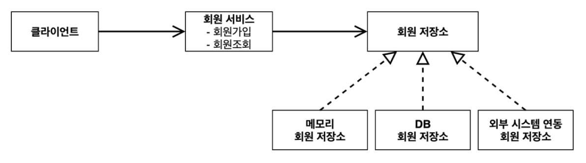

## 비즈니스 요구사항과 설계

* 회원
  * 회원을 가입하고 조회할 수 있다.
  * 회원은 일반과 VIP 두 가지 등급이 있다.
  * 회원 데이터는 자체 DB를 구축할 수 있고, 외부 시스템과 연동할 수 있다. (미확정)
* 주문과 할인 정책* 회원은 상품을 주문할 수 있다.
  * 회원 등급에 따라 할인 정책을 적용할 수 있다.
  * 할인 정책은 모든 VIP는 1000원을 할인해주는 고정 금액 할인을 적용해달라. (나중에 변경 될 수
있다.)
  * 할인 정책은 변경 가능성이 높다. 회사의 기본 할인 정책을 아직 정하지 못했고, 오픈 직전까지 고민을
미루고 싶다. 최악의 경우 할인을 적용하지 않을 수 도 있다. (미확정)

`요구사항을 보면 회원 데이터, 할인 정책 같은 부분은 지금 결정하기 어려운 부분이다. 그렇다고 이런 정책이
결정될 때 까지 개발을 무기한 기다릴 수 도 없다. 우리는 앞에서 배운 객체 지향 설계 방법이 있지 않은가!
인터페이스를 만들고 구현체를 언제든지 갈아끼울 수 있도록 설계하면 된다. 그럼 시작해보자.`


> 참고: 프로젝트 환경설정을 편리하게 하려고 스프링 부트를 사용한 것이다. 지금은 스프링 없는 순수한
자바로만 개발을 진행한다는 점을 꼭 기억하자! 스프링 관련은 한참 뒤에 등장한다. 


## 회원 도메인 설계

* 회원 도메인 요구사항
  *  회원을 가입하고 조회할 수 있다.
  *  회원은 일반과 VIP 두 가지 등급이 있다.
  *  회원 데이터는 자체 DB를 구축할 수 있고, 외부 시스템과 연동할 수 있다. (미확정)

##### 회원 도메인 협력 관계



##### 회원 클래스 다이어그램


##### 회원 객체 다이어그램


* 회원 서비스 : MemberServiceImpl

<br>
<br>

## 회원 도메인 개발

<br>

#### 회원 엔티티

<br>

##### 회원 등급
```java
package hello.core.member;

public enum Grade {
    BASIC,
    VIP
}
```

<br>

##### 회원 엔티티
```java
package hello.core.member;
public class Member {
    private Long id;
    private String name;
    private Grade grade;
 
    public Member(Long id, String name, Grade grade) {
        this.id = id;
        this.name = name;
        this.grade = grade;
    }
 
    public Long getId() {
        return id;
    }
 
    public void setId(Long id) {
        this.id = id;
    }
 
    public String getName() {
        return name;
    }
    public void setName(String name) {
        this.name = name;
    }
 
    public Grade getGrade() {
        return grade;
    }
 
    public void setGrade(Grade grade) {
        this.grade = grade;
    }
}
```

<br>

#### 회원 저장소

<br>

##### 회원 저장소 인터페이스
```java
package hello.core.member;

public interface MemberRepository {
    void save(Member member);
    Member findById(Long memberId);
}
```

<br>

##### 메모리 회원 저장소 구현체
```java
package hello.core.member;
import java.util.HashMap;
import java.util.Map;

public class MemoryMemberRepository implements MemberRepository {
    
    private static Map<Long, Member> store = new HashMap<>();
    
    @Override
    public void save(Member member) {
        store.put(member.getId(), member);
    }
 
    @Override
    public Member findById(Long memberId) {
        return store.get(memberId);
    }
}
```

`데이터베이스가 아직 확정이 안되었다. 그래도 개발은 진행해야 하니 가장 단순한, 메모리 회원 저장소를 구현해서 우선 개발을 진행하자.`

> : `HashMap` 은 동시성 이슈가 발생할 수 있다. 이런 경우 `ConcurrentHashMap` 을 사용하자

<br>

#### 회원 서비스

<br>

##### 회원 서비스 인터페이스
```java
package hello.core.member;

public interface MemberService {
    
    void join(Member member);
    Member findMember(Long memberId);
}
```

<br>

##### 회원 서비스 구현체
```java
package hello.core.member;

public class MemberServiceImpl implements MemberService {
 
    private final MemberRepository memberRepository = new MemoryMemberRepository();
    
    public void join(Member member) {
        memberRepository.save(member);
    }
 
    public Member findMember(Long memberId) {
        return memberRepository.findById(memberId);
    }
}
```

<br>

#### 회원 도메인 실행과 테스트

<br>

##### 회원 도메인 - 회원가입 main
```java
package hello.core;
import hello.core.member.Grade;
import hello.core.member.Member;
import hello.core.member.MemberService;
import hello.core.member.MemberServiceImpl;


public class MemberApp {

    public static void main(String[] args) {
        
        MemberService memberService = new MemberServiceImpl();
        Member member = new Member(1L, "memberA", Grade.VIP);
        memberService.join(member);
        
        Member findMember = memberService.findMember(1L);
        System.out.println("new member = " + member.getName());
        System.out.println("find Member = " + findMember.getName());
    }
}
```

`애플리케이션 로직으로 이렇게 테스트 하는 것은 좋은 방법이 아니다. JUnit 테스트를 사용하자.`

<br>

##### 회원 도메인 - 회원 가입 테스트
```java
package hello.core.member;
import org.assertj.core.api.Assertions;
import org.junit.jupiter.api.Test;
import static org.junit.jupiter.api.Assertions.*;


class MemberServiceTest {

    MemberService memberService = new MemberServiceImpl();
    
    @Test
    void join() {
        //given
        Member member = new Member(1L, "memberA", Grade.VIP);
 
        //when
        memberService.join(member);
        Member findMember = memberService.findMember(1L);
        
        //then
        Assertions.assertThat(member).isEqualTo(findMember);
    }
}
```

* 회원 도메인 설계의 문제점
  * 이 코드의 설계상 문제점은 무엇일까요?
  * 다른 저장소로 변경할 때 OCP 원칙을 잘 준수할까요?
  * DIP를 잘 지키고 있을까요?
  * __의존관계가 인터페이스 뿐만 아니라 구현까지 모두 의존하는 문제점이 있음 -> 주문까지 만들고나서 문제점과 해결 방안을 설명__

<br>

