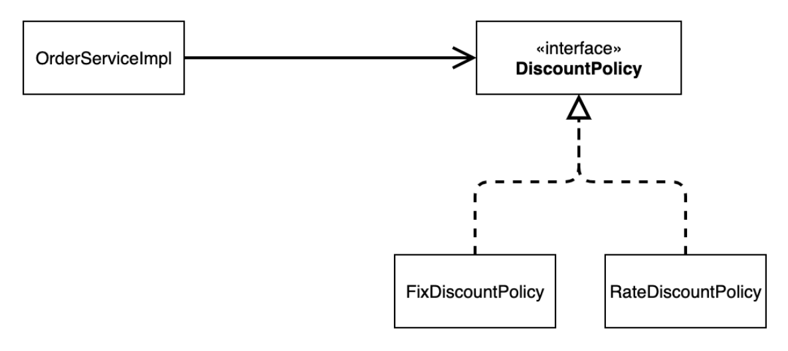
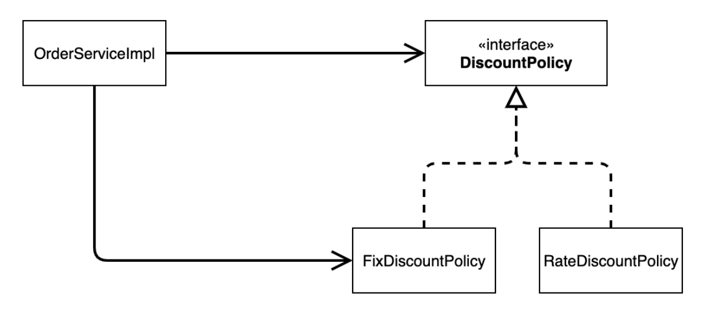
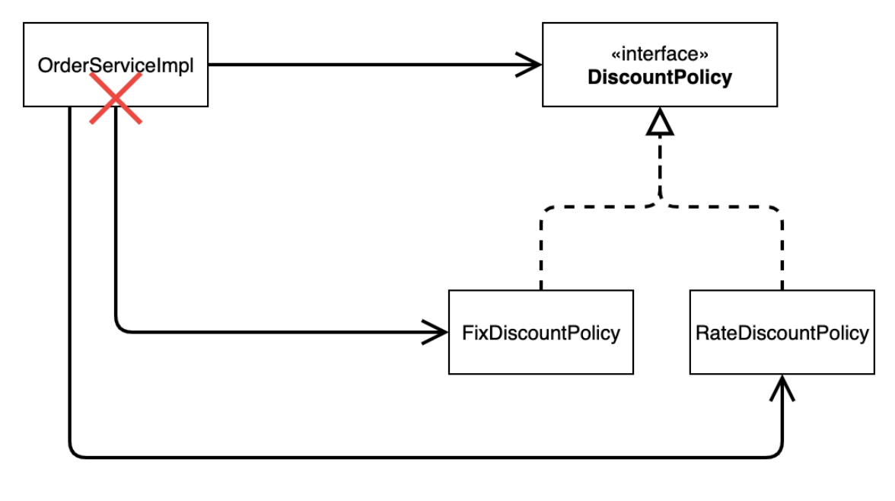
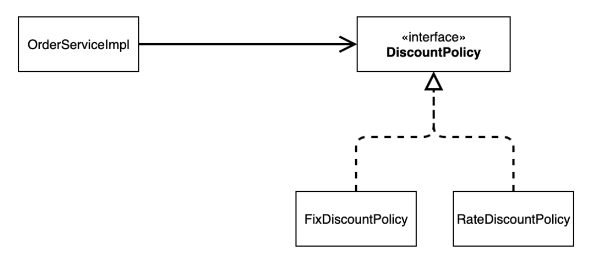

#### 새로운 할인 정책 개발

##### 새로운 할인 정책을 확장해보자.
* 악덕 기획자: 서비스 오픈 직전에 할인 정책을 지금처럼 고정 금액 할인이 아니라 좀 더 합리적인 주문
금액당 할인하는 정률% 할인으로 변경하고 싶어요. 예를 들어서 기존 정책은 VIP가 10000원을 주문하든
20000원을 주문하든 항상 1000원을 할인했는데, 이번에 새로 나온 정책은 10%로 지정해두면 고객이
10000원 주문시 1000원을 할인해주고, 20000원 주문시에 2000원을 할인해주는 거에요!
* 순진 개발자: 제가 처음부터 고정 금액 할인은 아니라고 했잖아요.
* 악덕 기획자: 애자일 소프트웨어 개발 선언 몰라요? “계획을 따르기보다 변화에 대응하기를”
* 순진 개발자: … (하지만 난 유연한 설계가 가능하도록 객체지향 설계 원칙을 준수했지 후후)

> 참고: 애자일 소프트웨어 개발 선언 https://agilemanifesto.org/iso/ko/manifesto.html

* 순진 개발자가 정말 객체지향 설계 원칙을 잘 준수 했는지 확인해보자. 이번에는 주문한 금액의 %를
할인해주는 새로운 정률 할인 정책을 추가하자.

<br>

##### RateDiscountPolicy 추가


<br>
<br>

##### RateDiscountPolicy 코드 추가
```java

```

<br>

##### 테스트 작성
```java

```
* 할인정책을 추가하고 테스트 까지 완료했다.

<br>
<br>
<br>

#### 새로운 할인 정책 적용과 문제점

##### 방금 추가한 할인 정책을 적용해보자.

<br>

__할인 정책을 애플리케이션에 적용해보자.__

<br>

##### 할인 정책을 변경하려면 클라이언트인 OrderServiceImpl 코드를 고쳐야 한다.
```java

```

* 문제점 발견
  * 우리는 역할과 구현을 충실하게 분리했다. OK
  * 다형성도 활용하고, 인터페이스와 구현 객체를 분리했다. OK
  * OCP, DIP 같은 객체지향 설계 원칙을 충실히 준수했다 -> 그렇게 보이지만 사실은 아니다.
  * DIP: 주문서비스 클라이언트 `OrderServiceImpl`는 `DiscountPolicy` 인터페이스에 의존하면서 DIP를 지킨 것 같은데? -> 클래스 의존관계를 분석해 보자. 추상(인터페이스) 뿐만 아니라 __구체(구현) 클래스에도 의존__ 하고 있다. 
  * -> 추상(인터페이스) 의존: `DiscountPolicy` / 구체(구현) 클래스: `FixDiscountPolicy`, `RateDiscountPolicy`
  * OCP: 변경하지 않고 확장할 수 있다고 했는데! -> __지금 코드는 기능을 확장해서 변경하면, 클라이언트 코드에 영향을 준다! 따라서 OCP를 위반한다.__

<br>

__왜 클라이언트 코드를 변경해야 할까?__
클래스 다이어그램으로 의존관계를 분석해보자.

<br>

##### 기대했던 의존관계



<br>

##### 실제 의존관계


* 잘보면 클라이언트인 `OrderServiceImpl` 이 `DiscountPolicy` 인터페이스 뿐만 아니라
`FixDiscountPolicy` 인 구체 클래스도 함께 의존하고 있다. 실제 코드를 보면 의존하고 있다! __DIP 위반__

<br>

##### 정책 변경



* __중요!__: 그래서 `FixDiscountPolicy` 를 `RateDiscountPolicy` 로 변경하는 순간 `OrderServiceImpl` 의
소스 코드도 함께 변경해야 한다! __OCP 위반__

<br>
<br>

##### 어떻게 문제를 해결할 수 있을까?

* 클라이언트 코드인 OrderServiceImpl 은 DiscountPolicy 의 인터페이스 뿐만 아니라 구체 클래스도
함께 의존한다.
* 그래서 구체 클래스를 변경할 때 클라이언트 코드도 함께 변경해야 한다.
* DIP 위반 추상에만 의존하도록 변경(인터페이스에만 의존)
* DIP를 위반하지 않도록 인터페이스에만 의존하도록 의존관계를 변경하면 된다.
<br>

__=> 인터페이스에만 의존하도록 설계를 변경하자__


<br>

##### 인터페이스에만 의존하도록 코드 변경
```java

```

* 인터페이스에만 의존하도록 설계와 코드를 변경했다.
* 그런데 구현체가 없는데 어떻게 코드를 실행할 수 있을까?
* 실제 실행을 해보면 NPE(null pointer exception)가 발생한다.

<br>

__해결방안__
* 이 문제를 해결하려면 누군가가 클라이언트인 OrderServiceImpl 에 DiscountPolicy 의 구현 객체를 대신 생성하고 주입해주어야 한다.

<br>
<br>
<br>

##### 관심사의 분리
* 애플리케이션을 하나의 공연이라 생각해보자. 각각의 인터페이스를 배역(배우 역할)이라 생각하자. 그런데!
실제 배역 맞는 배우를 선택하는 것은 누가 하는가?
* 로미오와 줄리엣 공연을 하면 로미오 역할을 누가 할지 줄리엣 역할을 누가 할지는 배우들이 정하는게 아니다. 이전 코드는 마치 로미오 역할(인터페이스)을 하는 레오나르도 디카프리오(구현체, 배우)가 줄리엣 역할(인터페이스)을 하는 여자 주인공(구현체, 배우)을 직접 초빙하는 것과 같다. 디카프리오는 공연도 해야하고 동시에 여자 주인공도 공연에 직접 초빙해야 하는 다양한 책임을 가지고 있다.

###### 관심사를 분리하자
* 배우는 본인의 역할인 배역을 수행하는 것에만 집중해야 한다.
* 디카프리오는 어떤 여자 주인공이 선택되더라도 똑같이 공연을 할 수 있어야 한다.
* 공연을 구성하고, 담당 배우를 섭외하고, 역할에 맞는 배우를 지정하는 책임을 담당하는 별도의 __공연 기획자__ 가 나올시점이다.
* 공연 기획자를 만들고, 배우와 공연 기획자의 책임을 확실히 분리하자.

<br>
<br>

##### AppConfig 등장
