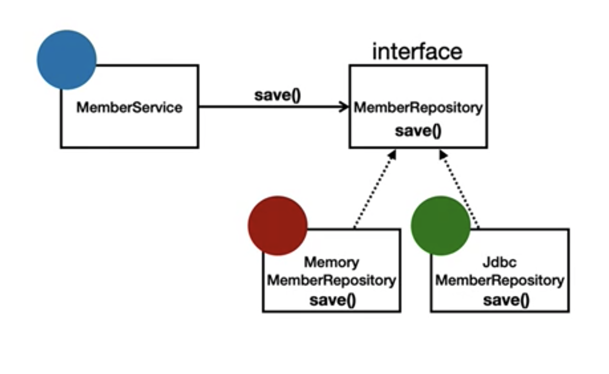

## Spring의 개념

#### 스프링의 진짜 핵심
- 스프링은 자바 언어 기반의 프레임워크
- 자바 언어의 가장 큰 특징 -> 객체 지향 언어
- 스프링은 객체 지향 언어가 가진 강력한 특징을 살려내는 프레임워크
- 스프링은 __좋은 객체 지향__ 어플리케이션을 개발할 수 있게 도와주는 프레임워크

#### 객체 지향 특징
1. 추상화
2. 캡슐화
3. 상속
4. __다형성__

#### 객체 지향 프로그래밍
- 객체 지향 프로그래밍은 컴퓨터 프로그램을 명령어의 목록으로 보는 시각에서 벗어나 여러 개의 독립된 단위, 즉 __객체__ 들의 모임으로 파악하고자 하는 것이다. 각각의 객체는 메시지를 주고받고 데이터를 처리할 수 있다(협력)
- 객체 지향 프로그래밍은 프로그램을 유연하고 변경이 용이하게 만들기 때문에 대규모 소프트웨어 개발에 많이 사용된다.

#### 유연하고 변경이 용이?
- 레고 블럭 조립하듯이
- 키보드, 마우스 갈아 끼우듯이
- 컴퓨터 부품 갈아 끼우듯이
- 컴포넌트를 쉽고 유연하게 변경하면서 개발할 수 있는 방법

#### 역할과 구현을 분리
- 역할과 구현으로 구분하면 세상이 단순해지고 유연해지며 변경도 편리해진다.
- 장점
  -  클라이언트는 대상의 역할(인터페이스)만 알면 된다.
  -  클라이언트는 구현 대상의 내부 구조를 몰라도 된다.
  -  클라이언트는 구현 대상의 내부 구조가 변경되어도 영향을 받지 않는다.
  -  클라이언트는 구현 대상 자체를 변경해도 영향을 받지 않는다.
- 자바 언어의 다형성을 활용
  -  역할 = 인터페이스
  -  구현 = 인터페이스를 구현한 클래스, 구현객체
- 객체를 설계할 때 `역할`과 `구현`을 명확히 분리 
- 객체 설계시 역할(인터페이스)을 먼저 부여하고, 그 역할을 수행하는 구현객체 만들기

#### 객체의 협력이라는 관계부터 생각
- 혼자 있는 객체는 없다.
- 클라이언트 : 요청 / 서버 : 응답
- 수 많은 객체 클라이언트와 객체 서버는 서로 협력 관계를 가진다.

#### 자바 언어의 다형성
-  오버라이딩
-  다형성으로 언터페이스를 구현한 객체를 실행 시점에 유연하게 변경할 수 있다.
-  물론 클래스 상속 관계도 다형성, 오버라이딩 적용가능

#### 다형성의 본질
- 인터페이스를 구현한 객체 인스턴스를 실행 시점에 유연하게 변경할 수 있다.
- 다형성의 본질을 이해하려면 협력이라는 객체사이의 관계에서 시작해야함.
- __클라이언트를 변경하지 않고, 서버의 구현 기능을 유연하게 변경할 수 있다.__

#### 스프링과 객체 지향
- 다형성이 제일 중요하다!
- 스프링은 다형성을 극대화해서 이용할 수 있게 도와준다.
- 스프링에서 이야기하는 제어의 역전(IoC), 의존관계 주입(DI)은 다형성을 활용해서 역할과 구현을 편리하게 다룰 수 있도록 지원한다.
- 스프링을 사용하면 마치 레고 블럭 조립하듯이! 공연 무대의 배우를 선택하듯이! 구현을 편리하게 변경할 수 있다.

#### SOLID
클린코드로 유명한 로버트 마틴이 좋은 객체 지향 설계의 5가지 원칙을 정리
1. SRP : 단일 책임 원칙
2. OCP : 개방-폐쇄 원칙
3. LSP : 리스코프 치환 원칙
4. ISP : 인터페이스 분리 원칙
5. DIP : 의존관계 역전 원칙

#### SRP 단일 책임 원칙
- 한 클래스는 하나의 책임을 가져야한다.
- 하나의 책임이라는 것은 모호하다.
  -  클 수도 있고, 작을 수도 있다.
  -  문맥과 상황에 따라 다르다.
- __중요한 기준은 변경__ 이다. 변경이 있을 때 파급 효과가 적으면 단일 책임 원칙을 잘 따른 것.
- 예) UI변경, 객체의 생성과 사용을 분리 

#### OCP 개방-폐쇄 원칙
- 소프트웨어 요소는 확장에는 열려 있으나 변경에는 닫혀 있어야한다.
- 이런 거짓말 같은 말이? 확장을 하려면 당연히 기존 코드를 변경?!
- 다형성을 활용해보자!
- 인터페이스를 구현한 새로운 클래스를 하나 만들어서 새로운 기능을 구현
- 지금까지 배운 역할과 구현의 분리를 생각해보자

#### OCP 개방-폐쇄 원칙의 문제점
- MemberService 클라이언트가 구현 클래스를 직접 선택
  -  MemberRepository m = new MemoryMemberRepository(); // 기존코드
  -  MemberRepository m = new JdbcMemberRepository(); // 변경코드
- 구현 객체를 변경하려면 클라이언트 코드를 변경해야한다.
- 분명 다형성을 사용했지만 OCP원칙을 지킬 수 없다.
- 이 문제를 어떻게 해결해야하나?
- 객체를 생성하고, 연관관계를 맺어주는 별도의 조립, 설정자가 필요하다!(Spring 컨테이너가 해줌!)

